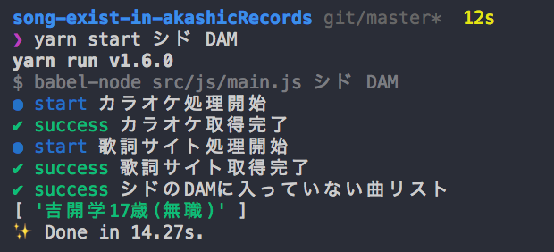

# song-exist-in-AkashicRecords

## アカシックレコードにアクセスし、歌手ごとのカラオケに存在しない曲を抽出するやつ

# 概要(Description)

歌手ごとのカラオケに入っていない曲を抽出してきて出力します。

現状カラオケ機種はDAMしか対応していません(2018/09/12)

Acquire songs that are not in singer's japanese karaoke(DAM or JoySound).

# Requirements(動作環境)

- MacOS X High Sierra 

# Installation(セットアップ方法)

- `npm install` or `yarn install`  
- `npm install -g babel-cli` 

# Usage(使用方法)

- `npm start アーティスト名 カラオケ機種(JoySound or DAM)`
- `yarn start アーティスト名 カラオケ機種(JoySound or DAM)`

- `npm start artistName karaokeType(JoySound or DAM)`
- `yarn start artistName karaokeType(JoySound or DAM)`

## example(例)

-  `yarn start ViViD DAM`
-  `yarn start Plastic_Tree DAM`

# Q&A

- アーティスト名にスペースが含まれる場合は？
  - スペース( )をアンダーバー(_)に置き換えて入力してください。
- If the artist name contains a space？(ex.Plastic Tree)
  - Please replace space( ) with underscore(_).

# Licence(ライセンス)

This software is released under the MIT License, see LICENSE.

[MIT](https://github.com/tcnksm/tool/blob/master/LICENCE)

# Authors(作者)

SugarShootingStar(@_Ancient_Scapes)